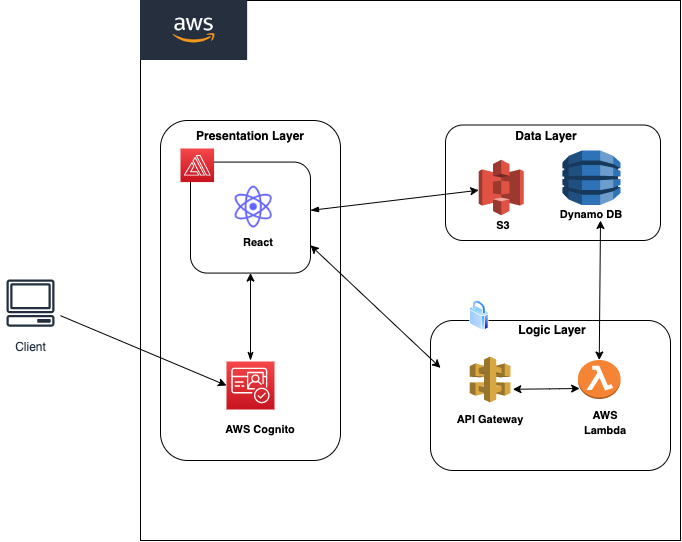

# She Mentors Africa

A mentoring app for young African women in ICT to connect to more experienced women in the field. 

## Tech Stack

**Client:** React and Material UI

**Server:** AWS Amplify and Express

## Architecture
 
 
## Demo 

Presentation link: https://docs.google.com/presentation/d/1bcJ6GDC8RIO2mgjpslOptAVzVtRFR1kQhJ_kW17IQyE/edit?usp=sharing
## Features

- Create an account/log in
- View mentors profiles
- Book a session (Mentees)
- Select Available slots (Mentors) 

## Acknowledgements

 - [React](https://reactjs.org/)
 - [Material UI](https://mui.com/)
 - [AWS](https://aws.amazon.com/)
 - [Yup](https://www.npmjs.com/package/yup)
 - [Formik](https://formik.org/)
 - [React Step Wizard](https://www.npmjs.com/package/react-step-wizard)
 - [React Shedule Meeting](https://www.npmjs.com/package/react-schedule-meeting)
 - [Full Calendar](https://fullcalendar.io/)
## Feedback

If you have any feedback, please reach out to us at ciradukunda2204@gmail.com
